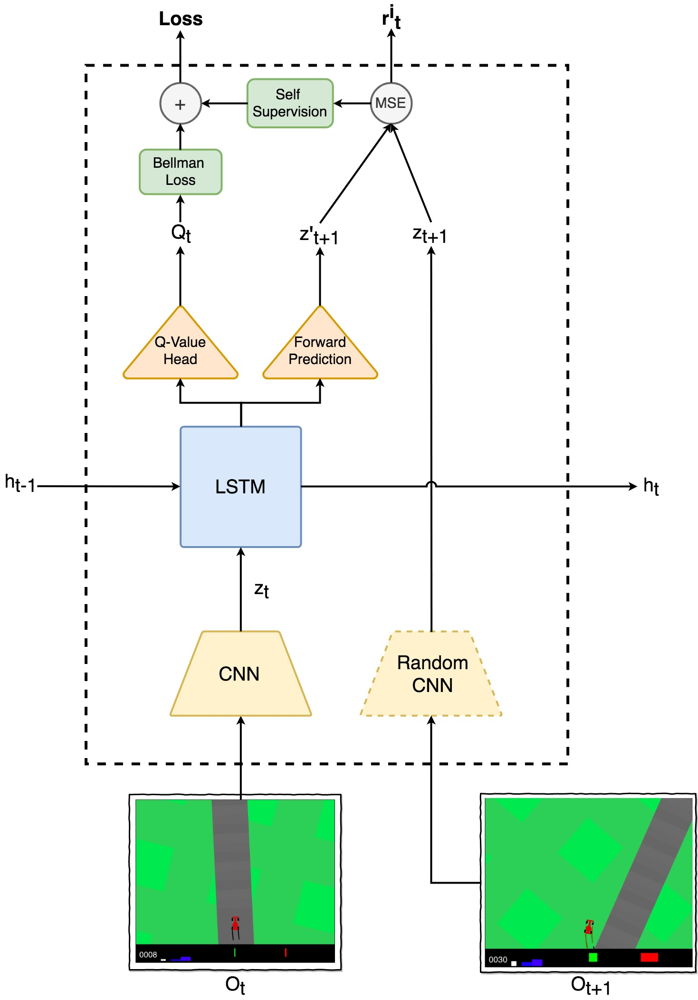

### A Curious Model Is All You Need

Curiosity is a type of dense intrinsic reward function which uses future prediction error as reward signal. 

### Model Architecture

### Details

[Link to poster](resources/Curiosity is All You Need  - Poster.pdf)

